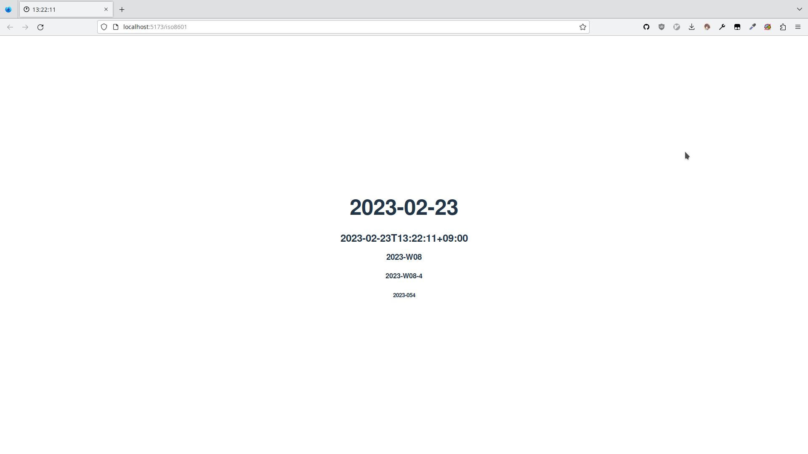

# ISO 8601

[][pages]

datetime display in
[ISO 8601](https://www.iso.org/iso-8601-date-and-time-format.html)

[Visit the page][pages]

## How to run

```sh
git clone https://github.com/scarf005/iso8601.git
cd iso8601
deno task dev
```

### How to test

```sh
deno test
```

## About

### License

AGPL-3.0.

see [LICENSE](LICENSE) for details.

### Credits

`src/assets/clock-hour-{N}.svg` are from
[tabler icons](https://tabler-icons.io). see [LICENSE](src/assets/LICENSE) for
details.

### Disclaimer

- This repository is not associated with the ISO 8601 standard.
- This software has absolutely no warranty.

[pages]: http://scarf005.github.io/iso8601
